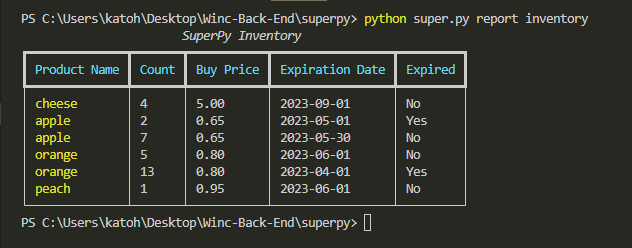

# SuperPy

>A command-line tool written in Python 3 that supermarkets use to keep track of their inventory.

<br>
<br>

## Requirements

-   Python version 3.10.10 or newer
    -   `python --version`
-   Modules from The Python Standard Library and some additional modules as described in this README

<br>
<br>

## Used Modules

-   argparse (https://docs.python.org/3/library/argparse.html)
-   calendar (https://docs.python.org/3/library/calendar.html)
-   csv (https://docs.python.org/3/library/csv.html)
-   datetime (https://docs.python.org/3/library/datetime.html)
-   os.path (https://docs.python.org/3/library/os.path.html)
-   rich (https://rich.readthedocs.io/en/stable/introduction.html)
    -   `pip install rich`
-   unittest (https://docs.python.org/3/library/unittest.html)
-   xlsxwriter (https://xlsxwriter.readthedocs.io/)
    -   `pip install XlsxWriter`

<br>
<br>

>**Note:** Depending on your python installation, install modules with `pip install <module>` or `pip3 install <module>` or; use the absolute path to pip/pip3: `/usr/local/bin/pip install <module>` or `/usr/local/bin/pip3 install <module>`.

<br>
<br>

## Commandline Options

-   `python super.py -h` or `python super.py --help`

```
usage: super.py [-h] [--database] [--product-name] [--price] [--expiration-date] [--advance-time] [--now] [--today] [--yesterday] [--date] [--export-format] [action] [report]

Process data

positional arguments:
  action                the action to perform: buy, sell or report
  report                the report action to perform: bought, sold, inventory, revenue or profit

optional arguments:
  -h, --help            show this help message and exit
  --product-name        the name of the product to buy or sell, example 'cherry'
  --price               the price of the product to buy or sell, example 0.95
  --expiration-date     the expiration date of the product to buy or sell (format as 'yyyy-mm-dd')
  --advance-time        advance the time by n days, where n >= 0; 0 will reset to today's date
  --now                 create report based on current data
  --today               create report on today's data setting
  --yesterday           create report based on yesterday's data
  --export-format       export inventory: csv, json or xlsx
  --date                report argument: revenue or profit (format as 'yyyy', 'yyyy-mm' or 'yyyy-mm-dd')
```

<br>
<br>

### **--advance-time**

>The internal conception of what day it is. Use `--advance-time 0` to reset the internal day to today’s date. This option does not require other arguments.

- `python super.py --advance-time 0`
- `python super.py --advance-time 1`
- `python super.py --advance-time 2`

<br>
<br>

### **buy**

>Record buys of products with `buy` and provide `--product-name`, `--price` and `--expiration-date`.

- `python super.py buy --product-name apple --price 0.75  --expiration-date 2023-06-01`
- `python super.py buy --product-name cheese --price 5.99 --expiration-date 2023-10-01`
- `python super.py buy --product-name cherry --price 3.50 --expiration-date 2023-07-01`

<br>
<br>

### **sell**

>Record sells of products with `sell` and provide `--product-name` and `--price`.

- `python super.py sell --product-name apple --price 1.15`
- `python super.py sell --product-name cheese --price 7.95`
- `python super.py sell --product-name cherry --price 4.75`

<br>
<br>

### **report bought**

>Report bought products with `report` and `bought`.
- `python super.py report bought`

<br>
<br>

### **report sold**

>Report sold products with `report` and `sold`.
- `python super.py report sold`

<br>
<br>

### **report inventory**

>Report inventory with `report` and `inventory` and provide an optional time argument `--now`, `--today`, `--yesterday` or `--date <date>`. Use `--export-format <type>` to store the report in the format specified.

- `python super.py report inventory`
- `python super.py report inventory --now`
- `python super.py report inventory --today`
- `python super.py report inventory --yesterday`
- `python super.py report inventory --export-format csv`
- `python super.py report inventory --export-format json`
- `python super.py report inventory --export-format xls`

<br>
<br>

### **report revenue**

>Report revenue with `report` and `revenue` and provide a required time argument `--now`, `--today`, `--yesterday` or `--date <date>`.

- `python super.py report revenue --now`
- `python super.py report revenue --today`
- `python super.py report revenue --yesterday`
- `python super.py report revenue --date 2023`
- `python super.py report revenue --date 2023-05`
- `python super.py report revenue --date 2023-05-18`

<br>
<br>

### **report profit**

>Report revenue with `report` and `profit` and provide a required time argument `--now`, `--today`, `--yesterday` or `--date <date>`.

- `python super.py report profit --now`
- `python super.py report profit --today`
- `python super.py report profit --yesterday`
- `python super.py report profit --date 2023`
- `python super.py report profit --date 2023-05`
- `python super.py report profit --date 2023-05-18`

<br>
<br>

## **Report preview:**
>A table reported with the `rich` module.

