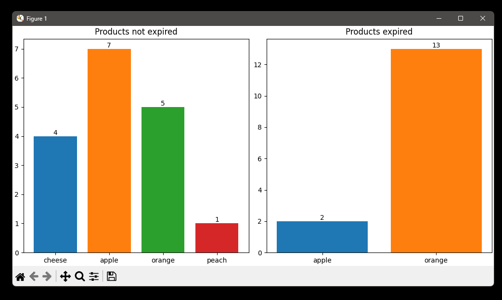

# Report

Three technical elements of my implementation that are notable.

### 1. Use of Classes

Classes are used for all core functionality of the app and use the built-in `__init__` method. Classes help to keep the code easy to read and reusable. Classes are stored in a  directory called classes and are referenced as from classes.

### 2. Csv and Report files

All `csv` files and `report` files are stored in the `files` folder
If the `files` folder has not been created, it will be created. New data is written using append `mode='a'`, so there is no need to replace the whole file when just adding data.
`Report` files can be exported as `csv`, `json` and `xlsx`.

### 3. Uses of MatPlotLib

When the inventory is reported, Matplotlib is used to display bar charts. It then displays a bar chart of products that have not expired and a bar chart of products that have expired.

